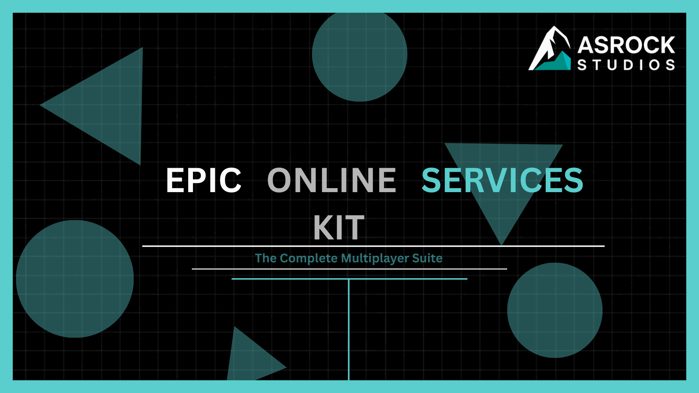
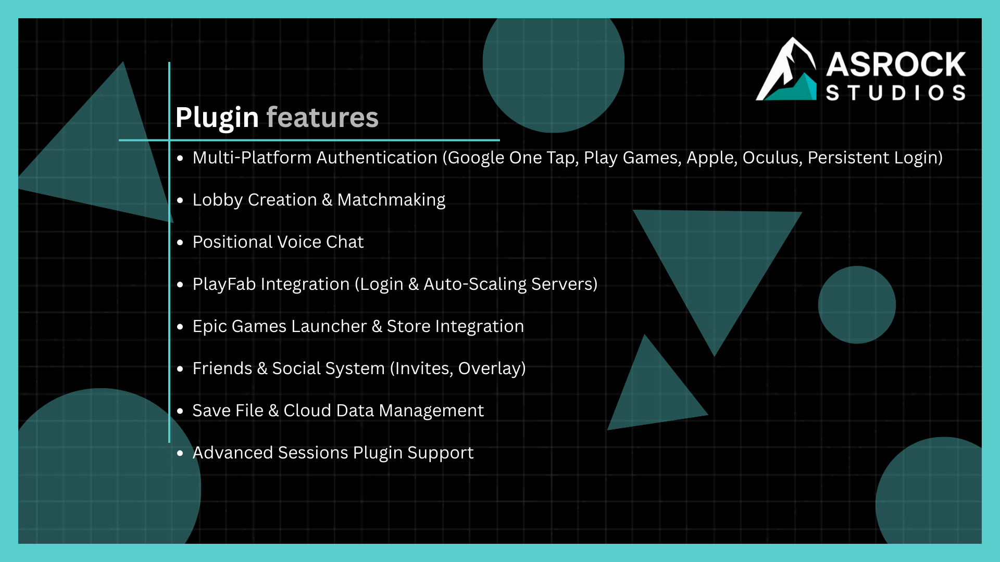
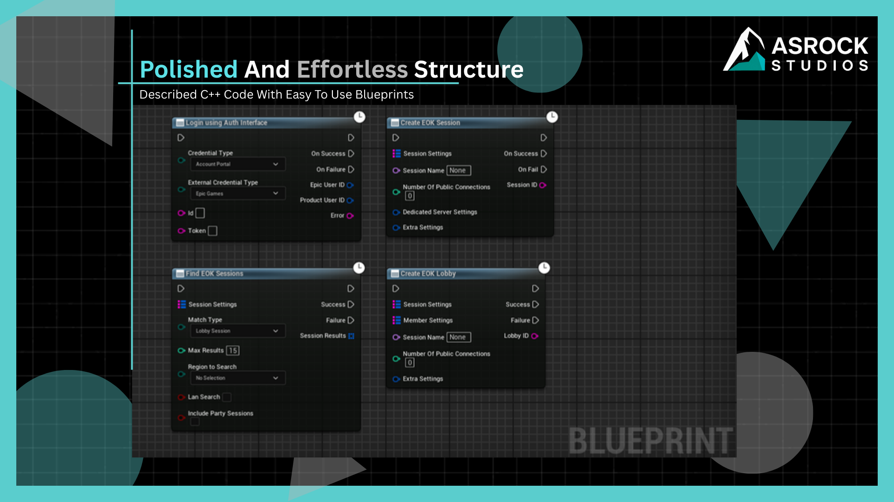
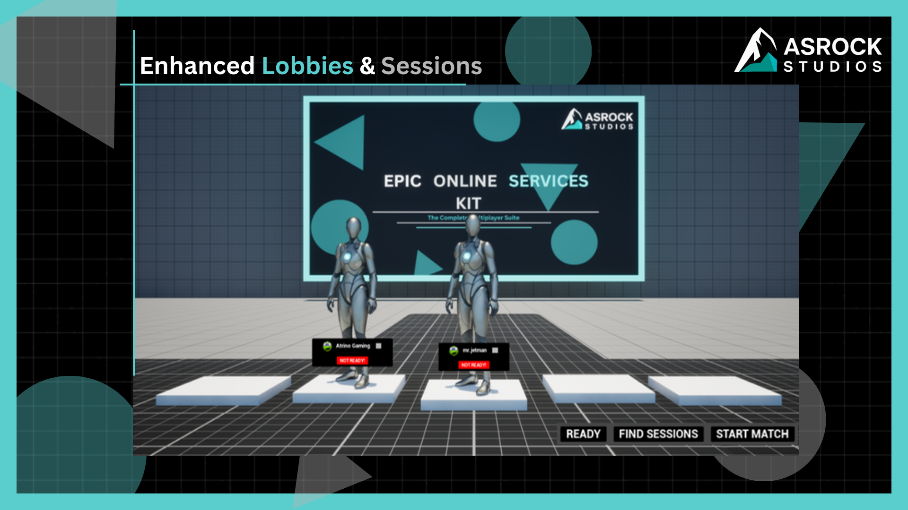
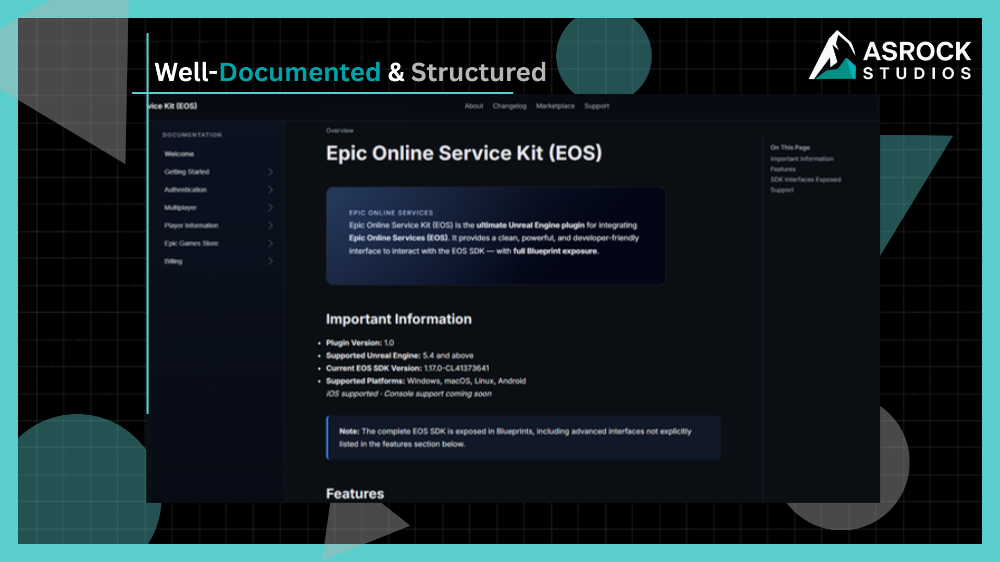

# Epic Online Services-Kit



**Epic Online Services-Kit (EOK)** is a production-ready Unreal Engine plugin for Epic Online Services (EOS) — authentication, sessions, lobbies, voice, stats, commerce, and more with full Blueprint support.

[Documentation](https://eok.asrockstudios.in/) · [Discord Support](https://discord.gg/c5jGEk2mxA) · [Asrock Studios](https://asrockstudios.in/)

---

## Plugin Features



- Multi-platform authentication (Google One Tap, Play Games, Apple, Oculus, persistent login)
- Lobby creation and matchmaking
- Positional voice chat
- PlayFab integration (login and auto-scaling servers)
- Epic Games Launcher and store integration
- Friends and social system (invites, overlay)
- Save file and cloud data management
- Advanced Sessions plugin support

---

## Blueprints

Polished C++ with easy-to-use Blueprint nodes for login, sessions, lobbies, and more.



### First Login (Blueprint / C++)

Use the **Login using Auth Interface** async node or the C++ auth subsystem. Configure EOS credentials in `DefaultEngine.ini` under `[EOSSDK]` before your first login attempt.

```cpp
// Example: trigger auth from C++ (see EOK_Auth_Login / subsystem APIs in Source)
```

---

## Enhanced Lobbies & Sessions



Built-in lobby flow with player ready states, session search, and match start — ready to wire into your game mode or replace with your own UI.

---

## Documentation



Full docs at **[eok.asrockstudios.in](https://eok.asrockstudios.in/)** — getting started, authentication, multiplayer, player info, store, and billing.

| | |
|---|---|
| **Plugin version** | 1.0 |
| **Supported UE** | 5.4 – 5.7 (use matching branch) |
| **Platforms** | Windows, macOS, Linux, Android |

---

## Installation

1. Clone the repo (`main` = latest UE 5.7, or pick a version branch):
   ```bash
   git clone https://github.com/parthkalla/EpicOnlineServices-Kit.git
   ```
2. Copy the plugin into your project's `Plugins/` folder.
3. Add third-party SDK binaries locally — see [THIRD_PARTY_SETUP.md](THIRD_PARTY_SETUP.md).
4. Enable **Epic Online Services-Kit** in your `.uproject` and restart the editor.

### Engine branches

| Branch | Unreal Engine |
|--------|----------------|
| `5.4` | 5.4 |
| `5.5` | 5.5 |
| `5.6` | 5.6 |
| `5.7` | 5.7 |

---

## Support


Questions or issues? Join us on **[Discord](https://discord.gg/c5jGEk2mxA)**.

---

**Made by [Asrock Studios](https://asrockstudios.in/)**
